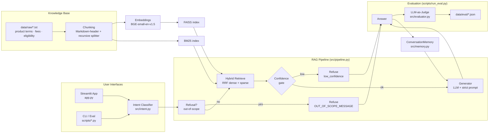

# NovaBank RAG Assistant

A grounded question-answering assistant for NovaBank's products, fees, and eligibility rules. It combines hybrid retrieval (dense + sparse) with LLM generation, refuses out-of-scope or low-confidence questions, and is evaluated end-to-end with an LLM-as-a-judge harness.

LINK: https://capstone-with-memory.streamlit.app/

---

## Table of Contents

- [Features](#features)
- [Architecture](#architecture)
- [Project Structure](#project-structure)
- [Setup](#setup)
- [Usage](#usage)
  - [Streamlit UI](#streamlit-ui)
  - [Interactive CLI](#interactive-cli)
  - [Run the evaluation](#run-the-evaluation)
- [Evaluation Metrics](#evaluation-metrics)
- [Design Summary](#design-summary)
- [Trade-offs](#trade-offs)
- [Limitations](#limitations)

---

## Features

- **Hybrid retrieval** — FAISS dense vectors (`BAAI/bge-small-en-v1.5`) fused with BM25 via Reciprocal Rank Fusion (RRF).
- **Intent-aware refusal** — LLM-based intent classifier plus a rule check for other-bank questions (ICICI, HDFC, SBI…) → out-of-scope refusal.
- **Grounding & citations** — every answer cites `[Source: chunk_id]` and is restricted to retrieved context.
- **Confidence gating** — answers are refused if the top retrieval score is below a threshold.
- **Conversation memory** — summary-buffer memory (recent turns verbatim + rolling LLM summary) for multi-turn chat.
- **LLM-as-a-judge evaluation** — faithfulness, relevancy, golden correctness, and refusal-correctness metrics over a golden QA set.
- **Streamlit UI** — chat interface with source inspection and a memory inspector.

---

## Architecture



**Request flow**

1. The question is classified into `fees | eligibility | product_terms | broad | out_of_scope`. Other-bank mentions short-circuit to `out_of_scope`.
2. If `out_of_scope`, the assistant refuses immediately.
3. Otherwise the query is embedded and searched against FAISS (dense) and BM25 (sparse); the two rank lists are fused with RRF and the top **8** chunks are returned.
4. If the top fused score is below the confidence threshold, the assistant refuses with `low_confidence`.
5. Otherwise the top **8** chunks are formatted with `[Source: chunk_id]` tags and passed to the generator, which answers strictly from context and cites every claim.
6. In chat mode, the conversation memory (summary buffer) is injected into the generator prompt to resolve follow-ups.

---

## Project Structure

```
.
├── app.py                    # Streamlit chat UI
├── database/                 # (reserved) local vector store
├── data/
│   ├── raw/                  # Source KB documents (ground truth)
│   │   ├── product_terms.txt
│   │   ├── fee_schedule.txt
│   │   └── eligibility_rules.txt
│   ├── qa_evaluation_set.txt # Golden 70-question eval set (refusals flagged answerable: no)
│   └── eval/                 # Eval results (git-ignored)
├── scripts/
│   ├── interactive.py        # CLI chat / one-shot query
│   └── run_eval.py           # Full evaluation runner
├── src/
│   ├── config.py             # LLM provider (OpenRouter/Groq) + retry wrapper
│   ├── documents.py          # Load + chunk the KB markdown
│   ├── index.py              # Build FAISS (dense) and BM25 (sparse) indexes
│   ├── retrieval.py          # Hybrid search + RRF + product boost
│   ├── intent.py             # Intent classifier + other-bank rule
│   ├── generator.py          # Strict generation prompt + confidence gate
│   ├── pipeline.py           # Orchestrates intent → retrieve → generate
│   ├── memory.py             # Summary-buffer conversation memory
│   └── evaluator.py          # LLM-as-judge scoring prompts
└── requirements.txt
```

---

## Setup

**Prerequisites**

- Python **3.10+** (tested on 3.14 on Windows)
- A **Groq** API key (OpenRouter is supported too — see the provider table below)

**Steps**

```bash
# 1. Clone
git clone -b memory-streamlit https://github.com/JatinKumar008/Capstone.git
cd Capstone

# 2. (Recommended) create a virtual environment
python -m venv .venv
# Windows
.venv\Scripts\activate
# macOS / Linux
source .venv/bin/activate

# 3. Install dependencies
pip install -r requirements.txt

# 4. Create your .env file (never commit it)
#    copy the example below into a file named `.env`
cat <<'EOF' > .env
GROQ_API_KEY=gsk_xxxxxxxxxxxxxxxx
LLM_PROVIDER=groq
LLM_MODEL=openai/gpt-oss-120b
EOF

# 5. (Optional) verify the pipeline loads
python -c "from src.pipeline import rag_pipeline; print('pipeline imports OK')"
```

> On first run, `sentence-transformers` downloads the embedding model `BAAI/bge-small-en-v1.5` from Hugging Face (~130 MB). Index build + embedding happens at startup.

**Provider switching**

The code uses the OpenAI SDK for both providers — only the base URL and key change (`src/config.py`):

| Provider | `.env` key | `LLM_PROVIDER` |
|---|---|---|
| Groq (default) | `GROQ_API_KEY` | `groq` |
| OpenRouter | `OPENROUTER_API_KEY` | `openrouter` |

---

## Usage

### Streamlit UI

```bash
python -m streamlit run app.py
```

Supports multi-turn chat, example questions, expandable source citations per answer, refusal banners, and a memory inspector sidebar.

### Interactive CLI

```bash
# One-shot
python scripts\interactive.py "What is the interest rate on a NovaFixed Deposit?"

# REPL mode (no argument)
python scripts\interactive.py
```

### Run the evaluation

```bash
python scripts\run_eval.py
```

By default this runs the **full 70-question golden assessment set** (60 answerable + 10 refusal/out-of-scope). Raw results are written to `data/eval/eval_results.json` and the aggregate to `data/eval/summary.json`. The sample composition is controlled by the constants at the top of `scripts/run_eval.py`:


> The sample constants can be tuned to focus on specific subsets of the golden set if desired.

---

## Evaluation Metrics

Computed per answer by an LLM judge (`src/evaluator.py`):

- **Golden Accuracy** — semantic match between the generated answer and the reference answer (`0/0.5/1`).
- **Faithfulness** — whether all claims are grounded in the retrieved context (`0–1`).
- **Relevancy** — whether the answer addresses the question (`0–1`).
- **Refusal Correctness** — whether the system refused exactly when it should have (`0/1`).
- **Latency** — per-question and p95.

The aggregate `summary.json` reports `samples`, `accuracy`, `faithfulness`, `refusal_correctness`, `p95_latency_ms`.

---

## Design Summary

- **Chunking** — Markdown headers (`#`/`##`/`###`) delineate sections; each section is sub-split with `chunk_size=650`, `chunk_overlap=150`, preferring newline (table-row) boundaries so fee tables stay intact.
- **Retrieval** — dense (BGE-small-en-v1.5, normalized, inner-product FAISS) + sparse (BM25 over tokenized text), fused with RRF (`k=60`), top-8 selected, with a light product-mention boost (`novaprime`, `novasavings`, etc.).
- **Intent gating** — a small LLM call classifies intent; regex catches other-bank names → `out_of_scope` to avoid answering about competitors.
- **Generation** — strict grounding prompt at `temperature=0`, `max_tokens=600`, cites `[Source: chunk_id]`; if no chunk covers the question, it answers "not in our current documentation" rather than inventing facts.
- **Confidence gate** — refuses when the top RRF score `< 0.007`.
- **Memory** — recent turns kept verbatim; when token budget (1,200) is exceeded, the oldest turns are summarized by the LLM into a rolling recap.

---

## Trade-offs

| Decision | Why | Cost |
|---|---|---|
| Hybrid dense + sparse (RRF) | Dense catches semantic matches, BM25 catches exact terms (codes, numbers, product names) | Two indexes + two searches add latency |
| Intent-classifier before retrieval | Lets us refuse out-of-scope cheaply and bias retrieval | Extra LLM call per question (~2 calls/question total) |
| No reranker | Keeps stack light and fast | Top-8 RRF is sometimes noisy; rare retrieval misses |
| `temperature=0` generation | Deterministic, grounded answers | Slightly less natural phrasing; no creativity |
| LLM-as-judge evaluation | No hand-labeled feature engineering; catches semantic equivalence | Judge is non-deterministic and consumes tokens (`~4k tokens/question`) |
| Summary-buffer memory | Handles long conversations without blowing the context window | Summaries can drop exact numbers; summary requires an LLM call |
| Broad retrieval (no doc-type filter) | Fixes cross-document questions (e.g., fees vs product terms) | Marginally more noise in candidates |

---

## Limitations

- **Knowledge = `data/raw/*.txt` only.** The assistant cannot answer anything not in those three documents; if the golden set references facts absent from the docs, retrieval cannot help.
- **No source-of-truth validation.** Docs are trusted as-is; contradictory sections surface the conflict but are not reconciled.
- **Small embedding model.** `bge-small-en-v1.5` (384-dim) is fast but weaker than larger models on nuanced queries.
- **Confidence threshold is a blunt instrument.** Score calibration varies across query types; borderline questions can be over- or under-refused.
- **Token budget.** Each question costs ~2 pipeline calls + up to 3 judge calls in eval mode (`~4k tokens/question`), which matters on rate-limited free tiers.
- **LLM judge noise.** Faithfulness/relevancy/correctness can still judge borderline answers inconsistently (occasional `parse error` fallback to `0.0`).
- **Windows console encoding.** Emoji/unicode prints require `PYTHONIOENCODING=utf-8` on some `cp1252` consoles.
